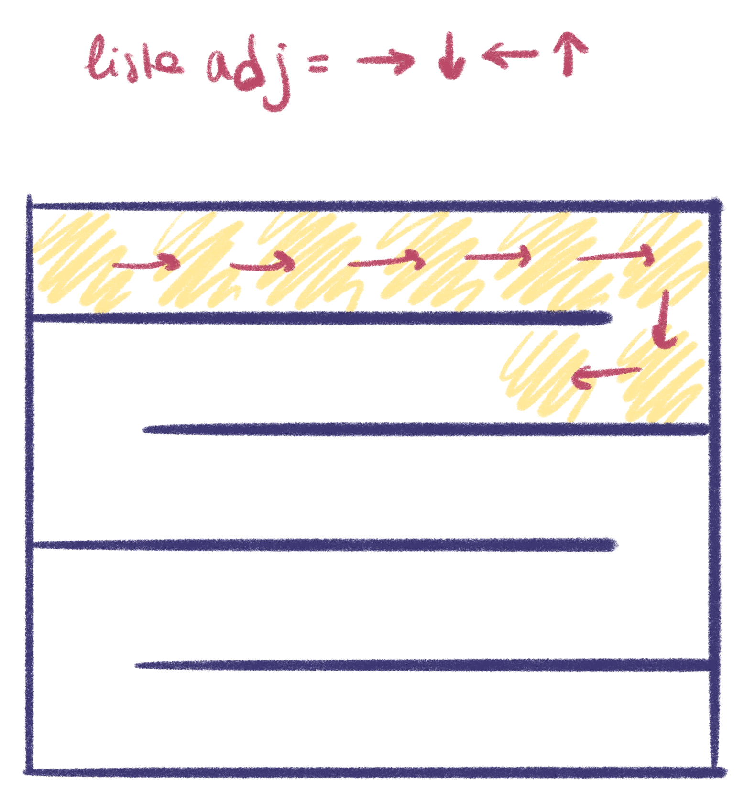
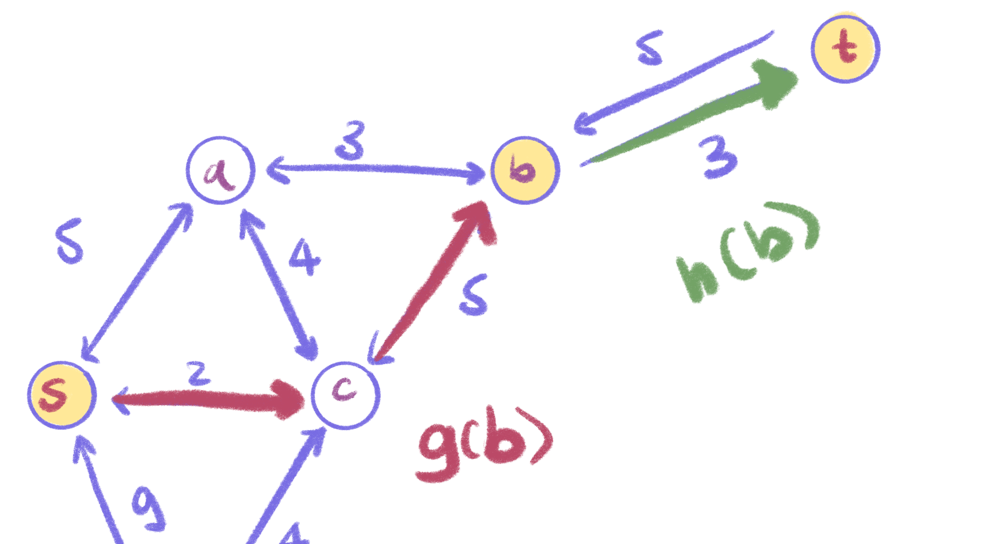

# Generazione e risoluzione di labirinti

---

#  Contenuti
- Caratteristiche di un buon labirinto
- Struttura dati
- Generazione: RandomDFS
- Risoluzione: A* search
    - Dimostrazione ammissibilità
    - Ottimalità con coerenza
    - Applicazione a un labirinto

---

### Caratteristiche di un buon labirinto
- Ha un bordo ben definito
- Ogni punto deve poter essere raggiungibile
- non è "noioso"

---

# struttura dati

---

### visivamente e ...

rappresentazione "visiva" &rarr; **griglia 2D NxM**

4 movimenti possibili &rarr; &larr; &darr; &uarr;

<!-- - N=#colonne, M=#righe 
- 4 possibili movimenti &rarr; &larr; &darr; &uarr; -->

---

### ... internamente
struttura interna &rarr; **grafo non orientato come lista di adiacenza "potenziale"**
- vertici = caselle
- archi = passaggi tra le caselle
- vettore di N*M vertici 
- ogni vertice ha *almeno* 4 adiacenti, a parte i vertici al bordo &rarr; Bordo ben definito dalla connettività &#x2714;

**complessità spaziale:**
- O(N*M) vettore di vertici
- O(N\*M) lista di adiacenza come vettore di vettori (sarebbe <4\*N*M)

---

# Generazione : RandomDFS

---

### DFS ...
- si utilizza la capacità del Depth First Search di generare un albero di copertura &rarr; Ogni punto è raggiungibile &#x2714;
- DFS seleziona gli archi "da aprire" &rarr; lista di adiacenza del labirinto è quella senza muri

---

### ... randomizzato

- DFS non randomizzato crea un unico lungo corridoio in base a come è inizializzata la lista 
- scelgo un vertice adiacente a caso non ancora visitato e lo visito
- appena arrivo a un punto dove non ci sono più mosse disponibili "chiudo" il vertice e faccio il backtracking
- A causa della scelta random è meglio usare uno stack esplicito dove salvare i vertici "in progress"/Grey invece di una chiamata ricorsiva

--

### DFS non randomizzato

---

## pseudocodice
<pre><code data-line-numbers> RandomDFS(G,start)
    Stack S;
    S.push(start); //O(1)

    while(S non vuoto):
        u = S.top(); //O(1)
        u.col=GREY;
        inizializzare vettore vertici AdjDisponibili/AdjWhite //O(4)=O(1)
        se (AdjWhite non vuoto):
            selezionare vertice random in AdjWhite;
            random.parent=u;
            breakWall(u,random); //O(4)=O(1)
            S.push(random);
        else //nessun movimento possibile
            u.col=BLACK;
            estrarre vertice u da S; //O(1)
</code></pre>

WORST CASE:
- **Complessità spaziale:** O(|V|)=O(N*M) &larr; caso "serpentone"
- **Complessità temporale:**  O(|V|+|E|)=O(N*M) &larr; 4 adiacenti per ogni vertice al massimo

---

# Esempio

--

# Esempio

--

# Esempio

---

# Risoluzione: A* search

---

## A* search
- inventato nel 1968
- Classe di algoritmi **euristici**
- Lavora su grafi pesati &rarr; labirinto: **tutti i pesi sono 1**
- **INFORMED SEARCH** vs **UNINFORMED SEARCH** (Dijkstra)
- Come Dijkstra A* minimizza una funzione $\tilde{f}(n)$  
- A* ottimo sotto euristica:
    - **Ammissibile**: $\tilde{h}(n)\leq h(n)$ &rarr; A* trova lo shortest path
    - **Coerente (Consistent):** $h(m,n) + \tilde{h}(m)\leq \tilde{h}(n)$ &rarr; A* esplora meno vertici rispetto ad altri algoritmi ammissibili 

---

## pseudocodice
<pre><code data-line-numbers> A*(G,start,goal)
    reset(maze); //O(N*M)

    start.g=0;
    start.fTilde=h(start,goal);
    
    OPEN={start}; //minHeap
    start.col=GREY;
    
</code></pre>

--

 <pre><code data-line-numbers data-ln-start-from="10"> while(OPEN non vuoto):
        estraggo u da OPEN con fTilde minimo; //log(N)
        se u=GOAL: exit;
        per adj in adjList(u) //con edge=OPEN
            costo = u.gTilde + w(u,adj) //u.gTilde = costo "so far" di u

            // se adj non ancora espanso
            // o il nuovo costo passando per u è minore del precedente 
            se (adj.col=WHITE oppure costo < adj.gTilde):
                adj.gTilde = costo;
                adj.fTilde = adj.gTilde + h(adj,goal);
                adj.parent = u;
                se adj not in OPEN //adj not GREY, se è BLACK lo riapro
                    adj.col=GREY
                    OPEN.add(adj); //log(N) Binomial heap/O(1) Fibonacci Heap 
                else OPEN.update(adj); //log(N)
        u.col=BLACK; //add to CLOSED list
</code></pre>

**Complessità worst case:**
- **Spaziale**: 
    - O(|V|+|E|)=O(N*M) per adj list
    - O(|V|)=O(N*M) per il MinHeap (in generale $\leq$ |V|)

--

<pre><code data-line-numbers data-ln-start-from="10"> while(OPEN non vuoto):
        estraggo u da OPEN con fTilde minimo; //log(N)
        se u=GOAL: exit;
        per adj in adjList(u) //con edge=OPEN
            costo = u.gTilde + w(u,adj) //u.gTilde = costo "so far" di u

            // se adj non ancora espanso
            // o il nuovo costo passando per u è minore del precedente 
            se (adj.col=WHITE oppure costo < adj.gTilde):
                adj.gTilde = costo;
                adj.fTilde = adj.gTilde + h(adj,goal);
                adj.parent = u;
                se adj not in OPEN //adj not GREY, se è BLACK lo riapro
                    adj.col=GREY
                    OPEN.add(adj); //log(N) Binomial heap/O(1) Fibonacci Heap 
                else OPEN.update(adj); //log(N)
        u.col=BLACK; //add to CLOSED list
</code></pre>

- **Temporale**:
    - O(|V|) resetMaze
    - O(|V|log|V|) per il pop in OPEN
    - O(|E|log|E|) per il push/update in OPEN considerando che ogni vertice chiuso non viene riaperto con un'euristica coerente &rarr; ogni vertice viene aggiunto una sola volta
    - TOTALE O((|V|+|E|)\*log|V|)=O(N\*M\*log(N\*M))
    - **N.B.**: il costo temporale dipende fortemente dalla funzione h(n,m) che non può essere conosciuta a priori rispetto al problema da risolvere 

---

## Esempio A*

--

## Esempio A*

--

## Esempio A*

--

## Esempio A*

---

## Dimostrazione di ammissibilità di A*

A* è ammissibile se trova il percorso ottimo (quindi di costo minore) da s a t per ogni $\delta$ grafo, i.e. ogni grafo i cui archi abbiano peso maggiore o uguale a $\delta> 0$

---

### Definizione della funzione di stima $\tilde{f}$

<!-- - $t\equiv$ vertice target 

- $s\equiv$ vertice iniziale --> 

- $P*\equiv(m,n)$ percorso ottimo (di costo minimo) tra m ed n

- $g(n)\equiv$ costo di P*(s,n)

- $h(n)\equiv$ costo di P*(n,t) 

- $f(n)\equiv$ costo reale di P*(s,t) vincolato attraverso n ($f(s)=h(s)$ costo di P*(s,t) non vincolato)

&rarr; $f(n)=g(n)+h(n)$

---

### Definizione della funzione di stima $\tilde{f}$

**$f(n)=g(n)+h(n)$ &rarr; stimato $\tilde{f}(n)=\tilde{g}(n)+\tilde{h}(n)$**

- $\tilde{g}(n)\equiv$ stima del costo di P*(s,n), è preso come il costo "so far" del percorso meno costoso, quindi $\tilde{g}(n)\geq g(n)$

- $\tilde{h}(n)\equiv$ stima del costo di P*(n,t), è **estraibile dal problema** p.e. nel caso in cui si considerasse una mappa, potrebbe essere la distanza in linea d'aria

**&rarr; Si dimostra che se $\tilde{h}(n)\leq h(n)$, ossia se la distanza minima è sottostimata, allora A\* è ammissibile:**

---

## LEMMA

Per ogni n NON CHIUSO e per ogni percorso ottimo P*(s,n), esiste n' su P* APERTO t.c. $\tilde{g}(n')=g(n)$

--

# dim

---

## COROLLARIO

Supponendo $\tilde{h}(n) \leq h(n)$  $\forall n $ e supponendo che A* non abbia terminato, allora per ogni percorso ottimo P*(s,t) esiste n' su P* APERTO t.c. $f(n')\leq f(s)$ con $f(s)$ costo reale del percorso ottimo P*(s,t)

-- 

# dim

---

## TEOREMA

Se $\tilde{h}(n) \leq h(n)$ $\forall n$, allora A* è ammissibile.

--

# dim